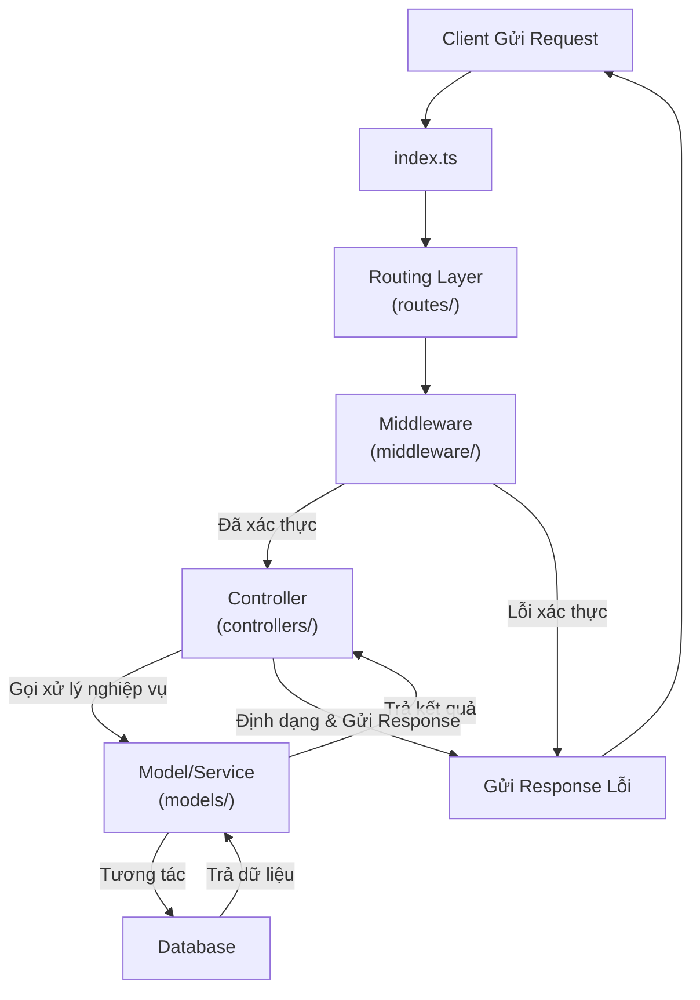

# A. Phân Tích Tổng quan Hệ Thống api-ecom 

## 1.Cấu Trúc Hệ Thống Backend

- Đây là một hệ thống backend được xây dựng bằng Node.js và TypeScript .Cấu trúc dự án được tổ chức theo một biến thể của mô hình `MVC (Model-View-Controller)`, rất phổ biến trong các ứng dụng web Node.js.
* Chi tiết về vai trò của từng thành phần chính:
- `index.ts`: Đây là điểm khởi đầu (entry point) của toàn bộ ứng dụng. Tệp này có nhiệm vụ khởi tạo server Express, kết nối đến cơ sở dữ liệu, và áp dụng các middleware cần thiết.
- `routes/`: Thư mục này định nghĩa các tuyến đường (API endpoints). Mỗi tệp trong đây thường tương ứng với một nhóm chức năng (ví dụ: products.routes.ts, users.routes.ts). Chúng nhận các yêu cầu HTTP (GET, POST, PUT, DELETE) và chuyển tiếp chúng đến các Controller tương ứng để xử lý.
- `controllers/`: Đây là nơi chứa logic điều khiển. Mỗi hàm trong controller chịu trách nhiệm xử lý một yêu cầu cụ thể từ client. Nó nhận dữ liệu từ request, gọi các Service (nếu có) để thực hiện các tác vụ nghiệp vụ, và cuối cùng là định dạng và gửi phản hồi (response) về cho client.
- `models/`: Định nghĩa cấu trúc dữ liệu (schema) cho các đối tượng trong ứng dụng, ví dụ như Product, User, Order. Các tệp này tương tác trực tiếp với cơ sở dữ liệu để thực hiện các thao tác CRUD (Create, Read, Update, Delete). Rất có thể bạn đang dùng một ODM (Object-Document Mapper) như Mongoose (cho MongoDB) hoặc một ORM (Object-Relational Mapper) như Sequelize/TypeORM (cho SQL).
- `middleware/`: Chứa các "phần mềm trung gian". Đây là các hàm được thực thi trước khi request được xử lý bởi Controller. Các middleware phổ biến bao gồm xác thực người dùng (authentication), kiểm tra quyền (authorization), ghi log (logging), hay xử lý lỗi.
- `database/`: Chứa các tệp cấu hình và khởi tạo kết nối đến cơ sở dữ liệu.
- `utils/`: Chứa các hàm tiện ích nhỏ, có thể tái sử dụng ở nhiều nơi trong dự án, ví dụ như hàm xử lý chuỗi, định dạng ngày tháng, hoặc các phép tính toán chung.
- `constants/`: Lưu trữ các giá trị hằng số được sử dụng trong toàn bộ ứng dụng, ví dụ như mã lỗi, các chuỗi thông báo, hoặc các cấu hình không thay đổi.
- `environments/`: Quản lý các biến môi trường cho các môi trường khác nhau như development, production, testing (ví dụ: chuỗi kết nối database, khóa bí mật).
`package.json`: Tệp kê khai của dự án Node.js. Nó chứa thông tin về dự án, danh sách các thư viện phụ thuộc (dependencies), và các script để chạy (ví dụ: start, dev, `build`). Việc phân tích tệp này sẽ cho biết chính xác các công nghệ, thư viện mà bạn đang sử dụng.

## 2. Luồng Xử Lý Cơ Bản của một Yêu Cầu



1. `Request:` Client (ví dụ: trình duyệt, ứng dụng di động) gửi một yêu cầu đến một API endpoint (ví dụ: POST /api/v1/products).

2. `Entry Point (index.ts):` Server Express nhận yêu cầu.

3. `Routing (routes/):` Express tìm kiếm trong các tệp route để xem có endpoint nào khớp với yêu cầu không.

4. `Middleware (middleware/):` Nếu route có đăng ký middleware (ví dụ: kiểm tra token JWT), middleware sẽ được thực thi. Nếu thành công, nó sẽ chuyển tiếp (next()) đến controller. Nếu không, nó sẽ trả về lỗi (ví dụ: 401 Unauthorized).

5. `Controller (controllers/):` Hàm controller tương ứng được gọi. Nó phân tích request (body, params, query) và gọi các hàm xử lý nghiệp vụ.

6. `Model (models/):` Controller (hoặc Service) sử dụng Model để tương tác với cơ sở dữ liệu (tìm kiếm, tạo mới, cập nhật sản phẩm...).

7. `Response:` Sau khi Model trả về dữ liệu, Controller sẽ định dạng lại và gói nó trong một đối tượng response (thường là JSON) rồi gửi trở lại cho Client.

---

## Phần A: Nền tảng Công nghệ & Cấu trúc Tổng quan
**1. Framework và Môi trường**:
-`Node.js & Express.js`: Cách Express được khởi tạo, cấu hình server.

- `TypeScript:` Lợi ích và cách cấu hình (tsconfig.json) trong dự án.
- `Mongoose & MongoDB`: Cách kết nối và định nghĩa `Schema` (trong models/). Đây là công nghệ cốt lõi để lưu trữ dữ liệu.

**2. Cấu trúc thư mục:** Phân tích sâu hơn vai trò của `controllers`, `models`, `routes`, `middleware` và cách chúng liên kết với nhau.

**3. Quản lý Cấu hình và Môi trường:**
- `dotenv`: Cách quản lý các biến môi trường (ví dụ: key bí mật, chuỗi kết nối DB).
- `ecosystem.config.js`: Phân tích tệp cấu hình cho PM2, một trình quản lý tiến trình cho `Node.js`, thường dùng trong môi trường production.

## Phần B: Các Luồng Nghiệp Vụ Chính (Business Flows)
Đây là phần quan trọng nhất, chúng ta sẽ mổ xẻ từng luồng nghiệp vụ dựa trên cấu trúc routes.

### I. Luồng Xác thực và Người dùng (Authentication & User)

- Công nghệ: jsonwebtoken (JWT), express-validator.
**Các chức năng:**
    1. Đăng ký (/register):
    - Validate dữ liệu đầu vào (express-validator).
    - Băm và lưu mật khẩu (Khả năng cao là dùng hook của Mongoose).
    - Tạo người dùng mới trong DB.
2. Đăng nhập (/login):
    - Tìm người dùng trong DB.
    - So sánh mật khẩu đã băm.
    - Thuật toán: Tạo cặp accessToken và refreshToken bằng jsonwebtoken.
3. Làm mới Token (/refresh-token):
    - Xác thực refreshToken.
    - Cấp accessToken mới.
4. Đăng xuất (/logout):
    - Cơ chế vô hiệu hóa token (nếu có, ví dụ: lưu vào blacklist).
    - Quản lý thông tin cá nhân: Xem, cập nhật thông tin (profile), đổi mật khẩu.

5. Quản lý thông tin cá nhân: 
    - Xem, cập nhật thông tin (profile), đổi mật khẩu.

### II. Luồng Quản lý Sản phẩm (Product Management)
- Công nghệ: mongoose (cho các truy vấn phức tạp).
- Các chức năng:
1. Tạo sản phẩm mới (Admin):
- Validate dữ liệu.
- Lưu sản phẩm vào DB.
2. Cập nhật sản phẩm (Admin):
- Tìm và cập nhật thông tin sản phẩm.
3. Xóa sản phẩm (Admin):
- Xóa mềm (soft-delete) hay xóa cứng (hard-delete)?
4. Lấy danh sách sản phẩm (Public/User):
- Thuật toán: Phân trang (Pagination), Sắp xếp (Sorting), Lọc (Filtering - theo giá, danh mục...), Tìm kiếm (Searching - theo tên sản phẩm). Các thuật toán này rất quan trọng cho hiệu năng và trải nghiệm người dùng.
5. Lấy chi tiết sản phẩm (Public/User):
- Lấy thông tin một sản phẩm dựa trên ID hoặc slug.

### III. Luồng Quản lý Giỏ hàng (Cart Management)
- Các chức năng:
1. Thêm sản phẩm vào giỏ hàng.
2. Xem giỏ hàng.
3. Cập nhật số lượng sản phẩm.
4. Xóa sản phẩm khỏi giỏ hàng.
- Kiến trúc: Giỏ hàng được lưu ở đâu? Trong DB gắn với user, hay trong localStorage của client? Chúng ta sẽ tìm hiểu.
### IV. Luồng Đặt hàng & Thanh toán (Order & Checkout)
- Các chức năng:
1. Tạo đơn hàng từ giỏ hàng:
- Lấy thông tin từ giỏ hàng, tạo một bản ghi Order mới.
- Thuật toán: Kiểm tra số lượng tồn kho (inventory check) trước khi đặt.
2. Xem lịch sử đơn hàng (User).
3. Xem chi tiết đơn hàng (User).
4. Quản lý đơn hàng (Admin):
- Xem tất cả đơn hàng.
- Cập nhật trạng thái đơn hàng (đang xử lý, đang giao, đã giao, đã hủy).
### V. Luồng Upload File/Hình ảnh
- Công nghệ: formidable, mv, shelljs.
- Các chức năng:
1. Upload ảnh đại diện (User).
2. Upload ảnh sản phẩm (Admin).
-  Luồng xử lý: Dữ liệu multipart/form-data được `formidable` xử lý như thế nào? File được lưu vào thư mục tạm rồi di chuyển (mv) đến thư mục upload/ ra sao?


# B. Phân tích chi tiết hệ thống 
##  1. Phân Tích `index.ts` Khởi Tạo và Cấu Hình Server

### 1. Khởi Tạo và Kết Nối Database:
- `import express from 'express':` Khởi tạo một ứng dụng Express, đây là framework chính để xây dựng API.
- `import { connectMongoDB } from './database/database':` Import hàm kết nối đến MongoDB.
- `connectMongoDB():` Lệnh này được gọi ngay khi ứng dụng khởi động. Điều này đảm bảo rằng ứng dụng chỉ bắt đầu nhận request sau khi đã kết nối thành công tới cơ sở dữ liệu. Đây là một thực hành tốt để tránh lỗi khi xử lý các request cần đến DB.
- `require('dotenv').config():` Dòng này nạp các biến môi trường từ file .env vào process.env. Nó được đặt ở đầu để đảm bảo các biến như PORT hay chuỗi kết nối MongoDB có sẵn cho toàn bộ ứng dụng.

### 2. Đăng Ký Middleware Toàn Cục (Global Middlewares):
Middleware được thực thi theo thứ tự chúng được khai báo với `app.use().`

`app.use(helmet()):` Sử dụng thư viện helmet. Đây là một middleware bảo mật quan trọng, nó tự động thiết lập các HTTP header an toàn (như X-Content-Type-Options, Strict-Transport-Security, X-Frame-Options, v.v.) để bảo vệ ứng dụng khỏi các lỗ hổng web phổ biến như *Cross-Site Scripting (XSS), clickjacking.*

`app.use(cors()):` Bật CORS (Cross-Origin Resource Sharing). Middleware này cho phép frontend (chạy trên một domain khác) có thể gọi các API của backend một cách an toàn mà không bị trình duyệt chặn.

`app.use(express.json()):` Middleware này phân tích (parse) body của các request có `Content-Type: application/json.` Nó biến chuỗi JSON từ request thành một đối tượng JavaScript và gán vào req.body.

`app.use(express.urlencoded({ extended: true })):` Middleware này phân tích body của các request có `Content-Type: application/x-www-form-urlencoded` (thường là từ các form HTML). Tùy chọn `extended: true` cho phép xử lý các đối tượng JSON lồng nhau.

### 3. Đăng Ký Tuyến Đường (Routing):

`import adminRoutes from './routes/admin/index.route'` (và tương tự cho user, common): Thay vì import từng file route lẻ, bạn có một file `index.route.ts` trong mỗi thư mục (admin, user, common). File này có nhiệm vụ tổng hợp tất cả các route con trong thư mục đó và export ra ngoài dưới một cấu trúc chung.

`const routes = [{ ...commonRoutes }, { ...userRoutes }, { ...adminRoutes }]:` Gom tất cả các nhóm routes lại thành một mảng duy nhất.

`routes.forEach(...):` Vòng lặp này tự động đăng ký tất cả các route vào ứng dụng Express.

- `item.prefix:` Là một tiền tố chung cho nhóm route (ví dụ: /api/v1/admin).

- `route.path:` Là đường dẫn cụ thể của route (ví dụ: /products).

- `route.route:` Là đối tượng router của Express chứa các phương thức (GET, POST...).

**Kết quả**: Một route hoàn chỉnh sẽ có dạng `app.use('/api/v1/admin/products', productRouter).` Cách làm này giúp code sạch sẽ, dễ bảo trì và mở rộng.

### 4. Phục Vụ Tệp Tĩnh (Serving Static Files - Hình ảnh):

`app.use('/${ROUTE_IMAGE}', ...handlerImage):` Đây là cơ chế để client có thể truy cập trực tiếp các tệp đã được upload (ví dụ: hình ảnh sản phẩm, avatar).

`express.static(...)`: `express.static` là một middleware tích hợp của Express để phục vụ các tệp tĩnh.
**Luồng xử lý:**
- `FOLDERS` là một hằng số chứa danh sách các thư mục con bên trong thư mục upload (ví dụ: ['avatars', 'products']).

- Đoạn code sử dụng `Object.values(FOLDERS).reduce(...)` để tự động tạo ra một middleware `express.static` cho mỗi thư mục con đó.

- Kết quả là khi client truy cập vào một URL có dạng `http://<domain>/images/products/some-image.jpg`, Express sẽ tìm và trả về tệp `some-image.jpg` từ thư mục `upload/products` trên server

### 5. Middleware Xử Lý Lỗi Toàn Cục (Global Error Handler):

- `app.use(function (err, req, res, next) { ... })`: Đây là một middleware xử lý lỗi đặc biệt của Express. Nó có 4 tham số `(err, req, res, next)`.

- Bất kỳ lỗi nào xảy ra trong các `route` (ví dụ: lỗi từ database, lỗi validate) và được truyền vào hàm `next(err)` sẽ được `"bắt"` bởi middleware này.

- `responseError(res, err):` Nó gọi một hàm tiện ích `responseError` (trong `utils/`) để định dạng và gửi một response lỗi chuẩn hóa về cho client. Điều này giúp đảm bảo tất cả các lỗi trong hệ thống đều có cùng một `định dạng JSON`, giúp phía frontend dễ dàng xử lý.

### 6. Khởi Động Server:
- `app.listen(process.env.PORT, ...):` Khởi động server, lắng nghe các kết nối đến trên cổng được định nghĩa trong biến môi trường PORT.

- `chalk.greenBright(...):` Sử dụng thư viện chalk để in ra một dòng log có màu xanh lá cây, giúp thông báo server đã khởi động thành công một cách trực quan hơn trên console.


**Tóm tắt và Kết luận:**
File `index.ts` cho thấy một cấu trúc dự án được thiết kế tốt, có tính module hóa cao và tuân thủ các thực hành tốt nhất:

- Tách biệt rõ ràng: Tách biệt kết nối DB, đăng ký middleware, routing và xử lý lỗi.
- Bảo mật: Sử dụng helmet làm lớp bảo vệ đầu tiên.
- Tự động hóa: Tự động đăng ký routes và các thư mục static, giúp giảm thiểu code lặp lại và dễ dàng mở rộng.
Xử lý lỗi tập trung: Có một trình xử lý lỗi toàn cục để đảm bảo response lỗi nhất quán.

---
*Tiếp theo, để hiểu rõ hơn về cách các route được tổ chức, chúng ta sẽ xem xét một trong các file `index.route.ts` ví dụ như của admin. Điều này sẽ làm sáng tỏ cấu trúc `prefix, path, route` mà chúng ta đã thấy ở trên.*

## 2. Phân tích cơ chế Routing

### 1. Phân Tích routes/admin/index.route.ts

#### 1. Cơ Chế Hoạt Động:
- Import: File này import tất cả các đối tượng router từ các file route chuyên biệt trong cùng thư mục (`admin-user.route.ts, admin-product.route.ts`, v.v.). Mỗi đối tượng router này (ví dụ `adminUserRouter`) là một thực thể của `express.Router()` và chứa các định nghĩa `endpoint` cụ thể (GET, POST, PUT, DELETE).

- Cấu Trúc Hóa: Nó gom các router đã import vào một đối tượng duy nhất là `adminRoutes.` Đối tượng này có một cấu trúc được định nghĩa trước, bao gồm hai thuộc tính quan trọng:

    - `prefix: "/admin/"`: Đây là tiền tố đường dẫn chung sẽ được áp dụng cho tất cả các route được định nghĩa bên trong đối tượng này.
    - `routes: [...]`: Đây là một mảng, mỗi phần tử trong mảng là một đối tượng đại diện cho một nhóm chức năng, bao gồm:
        - `path`: Đường dẫn con cụ thể cho nhóm chức năng đó (ví dụ: users, products).
        - `route`: Đối tượng router của Express được import ở trên, chứa logic xử lý cho đường dẫn đó.

#### 2. Luồng Ghép Nối Route (Kết hợp với index.ts):
Hãy xem cách cấu trúc này được "lắp ráp" lại trong file index.ts mà chúng ta đã phân tích trước đó:

1. File index.ts import adminRoutes từ file này.

2. Nó lặp qua mảng routes của adminRoutes.
3. Trong vòng lặp, nó lấy `prefix` và `path` để tạo ra một đường dẫn API hoàn chỉnh.
4. Sau đó, nó dùng `app.use()` để gắn đối tượng `route` (ví dụ `adminUserRouter`) vào đường dẫn hoàn chỉnh đó.
**Ví dụ cụ thể cho route quản lý người dùng:**

- `prefix` từ adminRoutes: `/admin/`
- `path` từ mảng routes: `users`
- `route` từ mảng routes: `adminUserRouter`
- Kết quả trong index.ts tương đương với: `app.use("/admin/users", adminUserRouter)`
- Nếu trong file `admin-user.route.ts` có một định nghĩa route là router.get("/", userController.getAllUsers), thì API endpoint cuối cùng để client gọi sẽ là: `GET /admin/users/.`
Tương tự:
Endpoint cho `sản phẩm` sẽ là: `/admin/products`/...
Endpoint cho `danh mục` sẽ là: `/admin/categories`/...
Endpoint cho `đơn hàng` sẽ là: `/admin/orders`/...
Endpoint cho `xác thực admin` (đăng nhập...) sẽ là: `/admin/`... (vì path là "").

#### 3. Ưu điểm của kiến trúc này:
- Module hóa và Rõ ràng (Modularity & Clarity): Mỗi file route (`admin-product.route.ts`) chỉ tập trung vào một tài nguyên duy nhất. File `index.route.ts` cho một cái nhìn tổng quan cấp cao về tất cả các API của admin mà không cần đọc code chi tiết.

- Dễ bảo trì và Mở rộng (`Maintainability & Scalability`): Khi cần thêm một nhóm chức năng mới cho admin (ví dụ: quản lý khuyến mãi), bạn chỉ cần:
1. Tạo file `admin-promotion.route.ts.`
Import nó vào `index.route.ts.`
2. Thêm một đối tượng mới vào mảng 
3. routes: { `path`: "`promotions`", `route`: `adminPromotionRouter` }.
Mọi thứ khác sẽ được `index.ts` xử lý tự động. Không cần sửa đổi logic ở tầng cao nhất.

- Tái sử dụng Tiền tố (`Prefix Reusability`): Tiền tố `/admin/` được định nghĩa một lần và áp dụng cho tất cả. Nếu sau này muốn đổi thành `/api/v1/admin/`, bạn chỉ cần sửa ở một nơi duy nhất.

*Kết luận về Hệ thống Routing:
Hệ thống routing của bạn được thiết kế rất tốt, phân cấp và có tính tự động hóa cao. Nó phân chia rõ ràng trách nhiệm giữa các cấp:
Cấp 1 (index.ts): "Bộ lắp ráp" cuối cùng, không quan tâm đến chi tiết route.
Cấp 2 (routes/*/index.route.ts): "Mục lục" cho từng nhóm quyền (admin, user), định nghĩa tiền tố và tổng hợp các route con.
Cấp 3 (routes/*/*.route.ts): "Chương sách" chi tiết, định nghĩa từng endpoint cụ thể cho một tài nguyên.*

---
## 3. Phân tích Luồng Xác thực và Người dùng (Authentication & User)

*Để phân tích luồng này, chúng ta cần xem xét routes/user/user-auth.route.ts (giả định tên file) và controllers/user/user-auth.controller.ts.*

### 1. ánh xạ Luồng User & Xác thực Dựa vào danh sách các file routes và controllers

- Xác thực (Authentication):
    - Route: Rất có thể nằm trong routes/common/ (vì đăng nhập/đăng ký là hành động chung)
    - Controller: auth.controller.ts
- Quản lý thông tin người dùng (User Profile):
    - Route: routes/user/user-user.route.ts
    - Controller: user.controller.ts
- Quản lý đơn hàng của người dùng (Purchases):
    - Route: routes/user/purchase.route.ts
    - Controller: purchase.controller.ts


---

#### 1.1**Phân Tích common-auth.route.ts**

File này định nghĩa **4 endpoints** sử dụng phương thức POST:

1. **POST /login**: Đăng nhập
2. **POST /logout**: Đăng xuất  
3. **POST /register**: Đăng ký
4. **POST /refresh-access-token**: Làm mới Access Token

> **💡 Điều đáng chú ý:** Việc sử dụng các **middleware** một cách tuần tự trước khi request đến được controller. Đây là một pipeline xử lý rất chuẩn mực.

---

#### 1.2 **Luồng xử lý của POST /register**

##### 🔍 **Bước 1: authMiddleware.registerRules()**

- **🎯 Mục đích:** Định nghĩa các quy tắc để kiểm tra (validate) dữ liệu đầu vào cho việc đăng ký.

- **⚙️ Công nghệ:** Chắc chắn đang sử dụng `express-validator`. Middleware này sẽ khai báo các yêu cầu như:
  - Email phải đúng định dạng
  - Password phải đủ mạnh (ví dụ: dài hơn 6 ký tự)
  - `confirm_password` phải khớp với `password`
  
- **📌 Lưu ý:** Nó *không* thực hiện validate ngay, mà chỉ **"khai báo"** các quy tắc.

##### ✅ **Bước 2: helpersMiddleware.entityValidator**

- **🎯 Mục đích:** Thực thi các quy tắc đã được định nghĩa ở bước trước. Nó sẽ kiểm tra `req.body` dựa trên `registerRules`.

- **🔄 Hoạt động:** 
  - **Nếu dữ liệu không hợp lệ:** Middleware này sẽ tạo ra một đối tượng lỗi và kết thúc chuỗi request-response ngay tại đây bằng cách gửi về lỗi `422 (Unprocessable Entity)` với chi tiết các trường bị lỗi.
  - **Nếu dữ liệu hợp lệ:** Nó sẽ gọi `next()` để chuyển sang handler tiếp theo.

##### 🚀 **Bước 3: wrapAsync(authController.registerController)**

- **🎯 Mục đích:** Nếu validation thành công, đây là nơi logic nghiệp vụ thực sự được gọi.

- **📋 Chi tiết:**
  - **`authController.registerController`**: Hàm controller chịu trách nhiệm tạo người dùng mới trong database.
  
  - **`wrapAsync(...)`**: Đây là một hàm tiện ích (utility function) rất quan trọng:
    - Các hàm controller thường là `async` (vì phải thao tác với DB)
    - Nếu có lỗi xảy ra bên trong một hàm `async` mà không có block `try...catch`, ứng dụng có thể bị crash
    - Hàm `wrapAsync` này bao bọc hàm controller lại, có nhiệm vụ **"bắt"** (catch) bất kỳ lỗi nào xảy ra và tự động chuyển nó cho middleware xử lý lỗi toàn cục của Express
    - Điều này giúp code trong controller sạch sẽ hơn, không cần viết `try...catch` ở khắp mọi nơi

---

#### 1.3 **Luồng xử lý của POST /login:**

-  Tương tự như /register, nhưng sử dụng authMiddleware.loginRules() để validate email và password.
---
#### 1.4 **Luồng xử lý của POST /logout**:

1. authMiddleware.verifyAccessToken:
- Mục đích: Middleware này bảo vệ endpoint. Nó kiểm tra xem `request` có gửi kèm Authorization header với một accessToken hợp lệ hay không.

- Hoạt động: Nó sẽ `giải mã token`. Nếu token không hợp lệ, hết hạn, hoặc không có, nó sẽ trả về lỗi 401 (Unauthorized). Nếu hợp lệ, nó sẽ `giải mã payload` (thường chứa user_id), gắn thông tin người dùng vào đối tượng req (ví dụ: req.user), và gọi `next()`.

2. `wrapAsync(authController.logoutController)`: 
Chỉ được thực thi nếu accessToken hợp lệ.
---
#### Luồng xử lý của POST /refresh-access-token:

1. `authMiddleware.verifyRefreshToken`:
- Mục đích: Tương tự như verifyAccessToken, nhưng nó `kiểm tra refreshToken` (thường được gửi trong body của request).
- Hoạt động: Xác thực `refreshToken`. Nếu hợp lệ, chuyển sang controller.

2. `wrapAsync(authController.refreshTokenController)`: Controller này sẽ tạo ra một accessToken mới.

>*Bây giờ chúng ta đã hiểu rõ "cổng vào" của các chức năng xác thực. Bước tiếp theo là xem xét "bộ não" xử lý logic: `controllers/auth.controller`.ts.*


#### Phân Tích controllers/auth.controller.ts và Các Thuật Toán


##### 🔐 **Chi Tiết Các Controller Xác Thực**

##### 1️⃣ **Luồng Đăng Ký (registerController)**

 🔍 **Bước 1: Kiểm tra sự tồn tại**

```javascript
await UserModel.findOne({ email: email }).exec()
```

- **🎯 Mục đích:** Truy vấn vào DB để tìm xem có người dùng nào đã sử dụng email này chưa
- **⚠️ Xử lý lỗi:** Nếu có (`userInDB` tồn tại), ném ra lỗi:
  ```javascript
  ErrorHandler(STATUS.UNPROCESSABLE_ENTITY, { email: 'Email đã tồn tại' })
  ```

> **💡 Điểm mạnh:** Cách xử lý lỗi nghiệp vụ rất tốt, trả về lỗi `422` với JSON object chỉ rõ trường nào bị lỗi và lý do, giúp frontend dễ dàng hiển thị thông báo.

##### 🔒 **Bước 2: Băm Mật Khẩu (Password Hashing)**

```javascript
const hashedPassword = hashValue(password)
```

- **📁 Vị trí:** Gọi đến hàm tiện ích `hashValue` (trong `utils/crypt`)
- **⚙️ Thuật toán:** Gần như chắc chắn sử dụng thư viện `bcrypt` hoặc `argon2`
- **🛡️ Bảo mật:** 
  - Biến mật khẩu plain-text thành chuỗi đã băm không thể đảo ngược (one-way hash)
  - **Tiêu chuẩn bắt buộc:** Tuyệt đối không bao giờ lưu mật khẩu dạng thô

##### 💾 **Bước 3: Tạo Người Dùng Mới**

```javascript
new UserModel(user).save()
```

- **🗄️ Database:** Tạo bản ghi User mới trong MongoDB với email và mật khẩu đã băm
- **🔄 Chuyển đổi:** `toObject()` để chuyển Mongoose Document thành đối tượng JavaScript thuần túy

##### 🎫 **Bước 4: Tạo Token (JWT Generation)**

**🔑 Thuật toán cốt lõi:**

1. **📋 Tạo Payload:**
   - Tạo đối tượng `payloadJWT` chứa thông tin định danh người dùng (id, email, roles)
   - **🔐 Quan trọng:** Việc đưa `roles` vào payload rất quan trọng cho việc phân quyền sau này

2. **✍️ Ký Token:**
   - Gọi hàm `signToken` (trong `utils/jwt`, sử dụng thư viện `jsonwebtoken`)
   - Tạo ra cả `access_token` và `refresh_token`

**🕐 Phân biệt 2 loại token:**

| Token Type | Thời gian sống | Mục đích |
|------------|----------------|----------|
| **Access Token** | Ngắn (15 phút) | Xác thực cho mỗi request API |
| **Refresh Token** | Dài (7 ngày) | Chỉ dùng để lấy access_token mới khi hết hạn |

##### 💿 **Bước 5: Lưu Token vào Database**

```javascript
new AccessTokenModel(...).save()
new RefreshTokenModel(...).save()
```

> **🌟 Điểm thiết kế quan trọng:** Hệ thống không chỉ tạo token mà còn lưu chúng vào DB và gắn với `user_id`

**🎯 Lợi ích lớn:**
- **🚪 Hỗ trợ Đăng xuất (Logout):** Có thể thực hiện đăng xuất thực sự bằng cách xóa token khỏi DB
- **👑 Kiểm soát phiên:** Admin có thể xem tất cả các phiên đang hoạt động và vô hiệu hóa bất kỳ phiên nào

##### 📤 **Bước 6: Trả về Response**

**📦 Nội dung trả về:**
- `access_token`, `refresh_token`
- Thời gian hết hạn của chúng
- Thông tin người dùng (đã loại bỏ mật khẩu bằng `omit(userAdd, ['password'])`)

---

#### 2️⃣ **Luồng Đăng Nhập (loginController)**

##### 🔍 **Bước 1: Tìm Người Dùng**
- Tìm user bằng email
- **🔒 Bảo mật:** Nếu không tìm thấy, trả lỗi *"Email hoặc password không đúng"*

> **💡 Lưu ý bảo mật:** Thông báo lỗi chung chung để tránh lộ thông tin email nào đã tồn tại trong hệ thống

##### 🔑 **Bước 2: So Sánh Mật Khẩu**

```javascript
const match = compareValue(password, userInDB.password)
```

- **📁 Hàm:** Gọi `compareValue` (trong `utils/crypt`)
- **⚙️ Thuật toán:** Sử dụng `bcrypt.compare()`
- **🔄 Quá trình:** So sánh mật khẩu plain-text với mật khẩu đã băm trong DB
- **❌ Xử lý:** Nếu không khớp (`!match`), trả về lỗi

##### ♻️ **Bước 3, 4, 5: Tương tự Đăng Ký**
Các bước còn lại (tạo và lưu token, trả về response) hoàn toàn tương tự như luồng đăng ký

---

#### 3️⃣ **Luồng Đăng Xuất (logoutController)**
 🔄 **Thuật toán:**

1. **📥 Lấy Token:** Lấy `access_token` từ header `Authorization`

2. **🗑️ Xóa Token:**
   ```javascript
   await AccessTokenModel.findOneAndDelete({ token: access_token })
   ```

3. **🚫 Hệ quả:** 
   - Kể từ thời điểm này, dù `access_token` vẫn còn hạn sử dụng
   - Nó sẽ không thể truy cập các tài nguyên được bảo vệ nữa
   - Middleware `verifyAccessToken` sẽ không tìm thấy token này trong DB

> **✅ Kết quả:** Đây là cơ chế logout rất hiệu quả và an toàn

---

#### 4️⃣ **Luồng Làm Mới Token (refreshTokenController)**

 🎯 **Bối cảnh:**
- `accessToken` của người dùng đã hết hạn
- `refreshToken` vẫn còn hạn
- Frontend gửi `refreshToken` lên endpoint này

🔐 **Middleware:** `verifyRefreshToken` đã xác thực `refreshToken` và giải mã `user_id` vào `req.jwtDecoded.id`

 🔄 **Thuật toán:**

1. **👤 Tìm User:** Sử dụng `user_id` từ token đã giải mã để tìm lại thông tin người dùng trong DB
2. **📋 Tạo Payload:** Tạo payload mới
3. **✍️ Ký Token:** Ký và tạo `access_token` mới với thời gian hết hạn mới
4. **💾 Lưu Token:** Lưu `access_token` mới vào DB
5. **📤 Trả về:** Gửi `access_token` mới về cho client để sử dụng cho các request tiếp theo

---

🏆 **Tổng Kết Luồng Xác Thực**

> **🌟 Đánh giá:** Đây là một hệ thống xác thực rất hoàn chỉnh và an toàn, áp dụng nhiều tiêu chuẩn hiện đại

🛡️ **Các Điểm Mạnh:**

| Tính năng | Mô tả | Lợi ích |
|-----------|--------|---------|
| **🔒 Băm mật khẩu** | Sử dụng `bcrypt` | Bảo mật tuyệt đối |
| **🎫 JWT kép** | Access & Refresh Token | Cân bằng bảo mật và UX |
| **💾 Lưu token vào DB** | Token tracking | Logout triệt để & kiểm soát phiên |
| **⚠️ Xử lý lỗi rõ ràng** | Structured error response | Frontend dễ tích hợp |
| **🏗️ Tách biệt logic** | Validation, routing, business logic | Kiến trúc sạch sẽ |

> 🎯 **Kết luận:**
Hệ thống này thể hiện một **kiến trúc enterprise-grade** với đầy đủ các tính năng bảo mật cần thiết cho một ứng dụng production.


### 2. 👤 **Phân Tích User Management System**

---

🗺️ **Phân Tích routes/user/user-user.route.ts**

File này được gắn vào prefix `/users` (do cấu hình trong `routes/user/index.route.ts`), và **tất cả các route** đều được bảo vệ bởi middleware `authMiddleware.verifyAccessToken`.

> **🔒 Bảo mật:** Chỉ người dùng đã đăng nhập mới có thể truy cập các endpoint này

---

#### 1️⃣ **GET /users**: Lấy thông tin cá nhân

**🔄 Pipeline:**

1. **🔐 `authMiddleware.verifyAccessToken`:**
   - Xác thực người dùng
   - **✅ Nếu thành công:** Thông tin user (đã giải mã từ token) sẽ được gắn vào `req`

2. **🎯 `wrapAsync(userController.getDetailMySelf)`:**
   - Gọi controller để lấy và trả về thông tin chi tiết của user đang đăng nhập

---

#### 2️⃣ **PUT /users**: Cập nhật thông tin cá nhân

**🔄 Pipeline:**

1. **📋 `userMiddleware.updateMeRules()`:**
   - Định nghĩa các quy tắc validate cho việc cập nhật
   - **Ví dụ:** `name` không được để trống, `date_of_birth` phải là định dạng ngày hợp lệ

2. **✅ `helpersMiddleware.entityValidator`:**
   - Thực thi các quy tắc validate
   - **❌ Nếu lỗi:** Trả về `422`

3. **🔐 `authMiddleware.verifyAccessToken`:**
   - Xác thực người dùng

4. **🎯 `wrapAsync(userController.updateMe)`:**
   - Gọi controller để cập nhật thông tin trong database

> **💡 Lưu ý:** Thứ tự của middleware `verifyAccessToken` có thể đặt trước hoặc sau validator. Đặt sau có thể tiết kiệm tài nguyên bằng cách không cần giải mã token nếu dữ liệu đầu vào đã sai.

---

#### 3️⃣ **POST /users/upload-avatar**: Tải lên ảnh đại diện

**🔄 Pipeline:**

1. **🔐 `authMiddleware.verifyAccessToken`:**
   - Xác thực người dùng

2. **📸 `wrapAsync(userController.uploadAvatar)`:**
   - Gọi controller xử lý việc tải file ảnh lên

---

### 3.🧠 **Phân Tích controllers/user.controller.ts (Luồng User Profile)**

---

#### 1️⃣ **Lấy Thông Tin Cá Nhân (getDetailMySelf)**

#### 🔍 **Logic cốt lõi:**

```javascript
(req as any).jwtDecoded.id
```

- **🎯 Mục đích:** Lấy `id` của người dùng từ payload của JWT
- **🔒 Bảo mật:** Đã được middleware `verifyAccessToken` giải mã và gắn vào `req`
- **✅ Ưu điểm:** Xác định "tôi" là ai một cách an toàn, thay vì tin vào `id` từ client gửi lên

#### 🗄️ **Truy vấn Database:**

```javascript
await UserModel.findById(...)
  .select({ password: 0, __v: 0 })
  .lean()
```

**📋 Phân tích từng phần:**

| Phần | Mục đích | Lợi ích |
|------|----------|---------|
| **`.select({ password: 0, __v: 0 })`** | Loại bỏ trường nhạy cảm | **🛡️ Bảo mật:** Không trả về `password` và `__v` |
| **`.lean()`** | Tối ưu hóa hiệu năng | **⚡ Nhanh hơn:** Trả về object thuần túy thay vì Mongoose Document |

#### 🔄 **Xử lý kết quả:**
- **❌ Không tìm thấy:** `!userDB` → Ném ra lỗi
- **✅ Thành công:** `responseSuccess(res, response)` → Gửi dữ liệu về client

---

#### 2️⃣ **Cập Nhật Thông Tin Cá Nhân (updateMe)**

> **🔥 Hàm phức tạp nhất:** Xử lý cả việc cập nhật thông tin thông thường và đổi mật khẩu

##### 🔍 **Lấy ID người dùng:**
```javascript
(req as any).jwtDecoded.id
```
Tương tự `getDetailMySelf`

##### 🔍 **Lọc dữ liệu đầu vào:**

```javascript
const user = omitBy({ ... }, (value) => value === undefined || value === '')
```

**🎯 Kỹ thuật hay:**
- Sử dụng `omitBy` của thư viện **lodash**
- Tạo object `user` chỉ chứa các trường thực sự được gửi lên để cập nhật
- **✅ Lợi ích:** Client chỉ cần gửi những gì muốn thay đổi, không cần gửi toàn bộ object

##### 🔐 **Xử lý Đổi Mật Khẩu (Logic quan trọng):**

```javascript
if (user.password) {
  // Logic đổi mật khẩu
}
```

**🔄 Các bước thực hiện:**

1. **🔍 Kiểm tra:** `user.password` có tồn tại không (tín hiệu đổi mật khẩu)

2. **🗄️ Lấy thông tin hiện tại:**
   ```javascript
   const userDB = await UserModel.findById(...)
   ```

3. **🔒 Băm mật khẩu cũ:**
   ```javascript
   const hash_password = hashValue(password)
   ```

4. **⚠️ So sánh mật khẩu:**
   ```javascript
   if (hash_password === userDB.password)
   ```

5. **🔄 Cập nhật mật khẩu mới:**
   ```javascript
   Object.assign(user, { password: hashValue(new_password) })
   ```

> **🚨 LỖI BẢO MẬT TIỀM ẨN:** Việc so sánh `hash_password === userDB.password` là không an toàn!

##### 💾 **Cập nhật vào Database:**

```javascript
await UserModel.findByIdAndUpdate(
  (req as any).jwtDecoded.id, 
  user, 
  { new: true }
)
.select({ password: 0, __v: 0 })
.lean()
```

**📋 Giải thích các option:**

| Option | Mục đích |
|--------|----------|
| **`{ new: true }`** | Trả về document **sau** khi cập nhật |
| **`.select({ password: 0, __v: 0 })`** | Loại bỏ trường nhạy cảm |
| **`.lean()`** | Tối ưu hóa hiệu năng |

---

#### 3️⃣ **Tải Lên Ảnh Đại Diện (uploadAvatar)**

🔍 **Logic cốt lõi:**

```javascript
const path = await uploadFile(req, FOLDERS.AVATAR)
```

**🎯 Ưu điểm:** Chuyển toàn bộ gánh nặng xử lý file cho hàm tiện ích `uploadFile`

 🔧 **Hàm uploadFile (có thể nằm trong utils/upload.ts):**

**📋 Chức năng dự kiến:**

1. **📦 Phân tích request:** Sử dụng thư viện `formidable` để xử lý `multipart/form-data`
2. **📁 Lấy file:** Extract file ảnh từ request
3. **🔑 Tạo tên unique:** Sử dụng UUID để tránh trùng lặp
4. **💾 Lưu file:** Vào thư mục `upload/avatars`
5. **🔗 Trả về đường dẫn:** Ví dụ: `images/avatars/unique-file-name.jpg`

 🔄 **Workflow hoàn chỉnh:**
1. **Controller** nhận đường dẫn từ `uploadFile`
2. **Frontend** nhận đường dẫn ảnh
3. **Frontend** gọi API `updateMe` để lưu đường dẫn vào DB

---

📊 **Tổng Kết và Đánh Giá**

 🌟 **Điểm Mạnh:**

| Tính năng | Mô tả | Lợi ích |
|-----------|--------|---------|
| **🔒 Xác thực JWT** | Dựa trên payload, không tin client | Bảo mật cao |
| **🛡️ Loại bỏ trường nhạy cảm** | Không trả về `password` | An toàn dữ liệu |
| **🔧 Tách biệt logic** | File upload riêng biệt | Code gọn gàng |
| **⚡ Tối ưu hóa** | Sử dụng `lodash.omitBy` | Cập nhật linh hoạt |
| **🏗️ Module hóa cao** | Controller riêng, utils riêng | Dễ bảo trì |

*🚨 **Điểm Cần Cải Thiện (Lỗi Bảo Mật):***

***❌ Lỗi nghiêm trọng trong `updateMe`:***

```javascript
// ❌ KHÔNG AN TOÀN
if (hash_password === userDB.password)

// ✅ CÁCH ĐÚNG
if (compareValue(password, userDB.password))
```

**🔍 Lý do:**
- Không nên so sánh trực tiếp hai chuỗi hash
- Phải sử dụng `compareValue` (tức `bcrypt.compare`) như trong `loginController`
- Đảm bảo tính nhất quán và bảo mật

---

> 🎯 **Kết Luận**

> **🏆 Đánh giá tổng quan:** Luồng quản lý người dùng được xây dựng khá tốt, an toàn và có tính module hóa cao, chỉ cần sửa lỗi bảo mật nhỏ trong việc so sánh mật khẩu.

**🔧 Khuyến nghị:** Ưu tiên sửa lỗi so sánh mật khẩu để đạt tiêu chuẩn bảo mật enterprise-grade.

---

## 4. **Luồng Quản lý Đơn hàng của Người dùng (Purchase Flow)**

### 1**Phân Tích routes/user/purchase.route.ts**
Tất cả các route trong đây đều được bảo vệ bởi authMiddleware.verifyAccessToken, đảm bảo chỉ người dùng đã đăng nhập mới có thể thực hiện các hành động này.

Dưới đây là các chức năng chính được định nghĩa:

1. POST /purchases/add-to-cart: Thêm sản phẩm vào giỏ hàng.
- Pipeline: Validate (addToCartRules, entityValidator) -> Xác thực (verifyAccessToken) -> Controller (addToCart).
- Mục đích: Thêm một sản phẩm với số lượng nhất định vào giỏ hàng của người dùng.
2. PUT /purchases/update-purchase: Cập nhật số lượng một sản phẩm trong giỏ hàng.
- Pipeline: Validate (updatePurchaseRules) -> Xác thực -> Controller (updatePurchase).
- Mục đích: Thay đổi số lượng của một sản phẩm đã có sẵn trong giỏ hàng (ví dụ: từ 2 thành 5).
3. GET /purchases: Lấy danh sách các sản phẩm trong giỏ hàng.
- Pipeline: Xác thực -> Controller (getPurchases).
- Mục đích: Hiển thị giỏ hàng cho người dùng xem.
4. DELETE /purchases: Xóa một hoặc nhiều sản phẩm khỏi giỏ hàng.
- Pipeline: Validate (deletePurchasesRules) -> Xác thực -> Controller (deletePurchases).
- Mục đích: Cho phép người dùng loại bỏ các sản phẩm không mong muốn khỏi giỏ hàng.
5. POST /purchases/buy-products: Mua các sản phẩm đã chọn (Đặt hàng).
- Pipeline: Validate (buyProductsRules) -> Xác thực -> Controller (buyProducts).
- Mục đích: Đây là bước cuối cùng của việc mua sắm. Nó sẽ chuyển các sản phẩm từ trạng thái "trong giỏ hàng" thành một "đơn hàng" chính thức.
6. POST /purchases/orders/:orderId/cancel: Hủy một đơn hàng đã đặt.
- Pipeline: Xác thực -> Controller (cancelOrder).
- Mục đích: Cho phép người dùng hủy một đơn hàng sau khi đã đặt, có thể trước khi đơn hàng được xử lý.

*Đây là một bộ API hoàn chỉnh cho việc quản lý giỏ hàng và đặt hàng. Bước tiếp theo là phân tích "bộ não" đằng sau nó: controllers/purchase.controller.ts. File này sẽ tiết lộ cách hệ thống quản lý trạng thái giỏ hàng, kiểm tra tồn kho và tạo đơn hàng.*

#### 1.**Kiến Trúc và Mô Hình Dữ Liệu**

Hệ thống sử dụng một model trung tâm là PurchaseModel. Một bản ghi (document) trong collection Purchase đại diện cho một dòng sản phẩm trong giỏ hàng hoặc trong một đơn hàng. Nó liên kết user, product, và chứa các thông tin quan trọng như buy_count (số lượng mua), price (giá tại thời điểm mua), và status.

Trường status là trái tim của hệ thống này, nó định nghĩa trạng thái của một mục hàng:

- STATUS_PURCHASE.IN_CART (-1): Đang nằm trong giỏ hàng, chưa đặt.
- STATUS_PURCHASE.WAIT_FOR_CONFIRMATION (0): Đã đặt hàng, đang chờ xác nhận.
- Các trạng thái khác có thể là: WAIT_FOR_GETTING (1), IN_PROGRESS (2), DELIVERED (3), CANCELLED (4).

#### 2.**Phân Tích Các Hàm Controller**
##### **1. addToCart (Thêm vào giỏ hàng)**
- B1: Kiểm tra tồn kho:
    -const product: any = await ProductModel.findById(product_id).lean(): Lấy thông tin sản phẩm.
    - if (buy_count > product.quantity): Kiểm tra nghiệp vụ quan trọng. So sánh số lượng khách muốn mua với số lượng tồn kho. Nếu không đủ, báo lỗi.
- B2: Kiểm tra sản phẩm đã có trong giỏ hàng chưa:
    - await PurchaseModel.findOne({ user: ..., status: STATUS_PURCHASE.IN_CART, product: ... }): Tìm một bản ghi Purchase của user này, cho sản phẩm này, và đang ở trạng thái IN_CART.
- B3: Xử lý logic:
    - Nếu đã có (purchaseInDb tồn tại):
        - await PurchaseModel.findOneAndUpdate(...): Cập nhật bản ghi Purchase đã có, cộng dồn buy_count mới vào buy_count cũ (purchaseInDb.buy_count + buy_count).
    - Nếu chưa có:
        - Tạo một đối tượng purchase mới với đầy đủ thông tin (user, product, buy_count, price, status). Việc lưu lại price và price_before_discount tại thời điểm này là rất quan trọng, để nếu sau này admin thay đổi giá sản phẩm thì cũng không ảnh hưởng đến giỏ hàng của người dùng.
        - await new PurchaseModel(purchase).save(): Tạo một bản ghi Purchase mới.

##### 2. **updatePurchase (Cập nhật giỏ hàng)**
- Logic tương tự addToCart, nhưng đơn giản hơn. Nó tìm bản ghi Purchase tương ứng và ghi đè buy_count bằng giá trị mới.
- Nó cũng có bước kiểm tra tồn kho (buy_count > purchaseInDb.product.quantity) để đảm bảo người dùng không thể cập nhật số lượng vượt quá số hàng có sẵn.
##### 3. **buyProducts (Đặt hàng - Hàm phức tạp nhất)**
- Đây là một "giao dịch" (transaction) nghiệp vụ, thực hiện nhiều bước nối tiếp nhau.
- B1: Kiểm tra thông tin người dùng:
    - const userProfile = await UserModel.findById(userId).lean(): Lấy thông tin người dùng.
    - if (!userProfileAny || !userProfileAny.name || !userProfileAny.phone || !userProfileAny.address): Kiểm tra ràng buộc nghiệp vụ. Bắt buộc người dùng phải cập nhật đầy đủ thông tin cá nhân trước khi cho phép đặt hàng.
- B2: Xử lý từng sản phẩm trong đơn hàng:
- for (const item of req.body): Lặp qua mảng các sản phẩm mà người dùng muốn mua.
- Kiểm tra tồn kho: Tương tự như addToCart.
- Cập nhật hoặc tạo bản ghi Purchase:
    - Tìm bản ghi Purchase có status: IN_CART.
    findOneAndUpdate(...) để đổi status thành WAIT_FOR_CONFIRMATION.
    - Nếu không tìm thấy (ví dụ: người dùng mua thẳng không qua giỏ hàng), tạo mới một bản ghi Purchase với status là WAIT_FOR_CONFIRMATION.
- Cập nhật kho hàng (Rất quan trọng):
    - const newQuantity = product.quantity - item.buy_count: Tính toán lại số lượng tồn kho.
    - await ProductModel.findByIdAndUpdate(...): Giảm số lượng sản phẩm trong ProductModel.
    - await ProductModel.findByIdAndUpdate(..., { $inc: { sold: item.buy_count } }): Tăng số lượng đã bán của sản phẩm.
- B3: Tạo bản ghi Đơn hàng (Order):
    - if (purchases.length > 0): Sau khi xử lý tất cả các sản phẩm thành công.
    - const items = purchases.map(...): Tạo một mảng các items cho đơn hàng, chỉ chứa - các thông tin cần thiết (tên, giá, số lượng).
    - const total = purchases.reduce(...): Tính tổng giá trị đơn hàng.
    - await OrderModel.create(...): Tạo một bản ghi mới trong collection Order. Bản ghi này tổng hợp lại thông tin của cả đơn hàng: ai mua, mua những gì, tổng tiền bao nhiêu, và trạng thái là gì. Nó cũng lưu lại purchaseIds để có thể truy vết về các bản ghi Purchase chi tiết.
- B4: Trả về Response: Trả về thông tin các purchases đã được cập nhật.

##### 4. **getPurchases (Lấy danh sách đơn hàng/giỏ hàng)**
- Hàm này rất linh hoạt, cho phép lấy danh sách các mục hàng theo status.
- const { status = STATUS_PURCHASE.ALL } = req.query: Lấy status từ query param. Nếu không có, mặc định là lấy tất cả.
- let condition = ...: Xây dựng một đối tượng điều kiện truy vấn cho Mongoose.
- if (Number(status) !== STATUS_PURCHASE.ALL): Nếu client có yêu cầu một status cụ thể (ví dụ: ?status=-1 để lấy giỏ hàng, ?status=0 để lấy các đơn hàng đang chờ xác nhận), thì thêm điều kiện đó vào query.
- await PurchaseModel.find(condition).populate(...): Tìm tất cả các bản ghi Purchase khớp với điều kiện. .populate('product') là một lệnh cực kỳ hữu ích của Mongoose, nó sẽ tự động lấy thông tin chi tiết của sản phẩm từ collection Product và gắn vào kết quả trả về.

---

**Tổng kết Luồng Mua hàng:**
- *Mô hình dữ liệu mạnh mẽ:* Sử dụng PurchaseModel với trường status để quản lý cả giỏ hàng và các mục trong đơn hàng là một cách tiếp cận hiệu quả và nhất quán.
- *Kiến trúc "lai":* Hệ thống cho phép cả hai luồng:
    - Thêm vào giỏ hàng -> Cập nhật giỏ hàng -> Đặt hàng.
    - Mua ngay mà không cần thêm vào giỏ hàng trước.
- *Kiểm tra nghiệp vụ chặt chẽ:* Kiểm tra tồn kho ở nhiều bước, kiểm tra thông tin người dùng trước khi đặt hàng.
- *Cập nhật dữ liệu toàn diện:* Khi đặt hàng, hệ thống không chỉ tạo đơn hàng mà còn cập nhật lại số lượng tồn kho và số lượng đã bán của sản phẩm, đảm bảo tính nhất quán của dữ liệu.

> Chúng ta đã phân tích xong các luồng chính dành cho người dùng. Kế hoạch tiếp theo là xem xét các luồng dành cho Admin và các luồng Common (công cộng)

## 5. **Luồng Quản Lý Sản Phẩm (Admin Product Management)**
### 1. **Phân Tích admin-product.route.ts**
Tất cả các endpoint ở đây đều được bảo vệ bởi một chuỗi middleware chung:

1. authMiddleware.verifyAccessToken: Đảm bảo người dùng đã đăng nhập.
2. authMiddleware.verifyAdmin: Đảm bảo người dùng có quyền admin (rất có thể bằng cách kiểm tra mảng roles trong JWT payload). Đây là lớp phân quyền cực kỳ quan trọng.
3. Các chức năng chính bao gồm:
- GET /admin/products: Lấy danh sách sản phẩm có phân trang. Nó cũng có các quy tắc validate (getProductsRules) cho các query param như page, limit.
- GET /admin/products/all: Lấy tất cả sản phẩm không phân trang (hữu ích cho các dropdown hoặc chức năng nội bộ).
- GET /admin/products/:product_id: Lấy chi tiết một sản phẩm.
- POST /admin/products: Tạo một sản phẩm mới.
- PUT /admin/products/:product_id: Cập nhật một sản phẩm đã có.
- DELETE /admin/products/delete/:product_id: Xóa một sản phẩm.
- DELETE /admin/products/delete-many: Xóa nhiều sản phẩm cùng lúc (dựa trên một danh sách các ID).
- POST /admin/products/upload-image: Tải lên một ảnh cho sản phẩm.
- POST /admin/products/upload-images: Tải lên nhiều ảnh cho sản phẩm.

> Kiến trúc middleware ở đây rất chặt chẽ, nó validate cả quyền truy cập, dữ liệu đầu vào (body) và tham số đường dẫn (params) trước khi chạm tới controller.

## 6. **Luồng Quản lý Danh mục (Category Management)**
### 1. **Phân Tích admin-category.route.ts**
Đây là một bộ API CRUD (Create, Read, Update, Delete) đầy đủ cho tài nguyên "Danh mục" (Category), và được bảo vệ nghiêm ngặt để chỉ admin mới có thể truy cập.

- Bảo vệ: Chuỗi middleware authMiddleware.verifyAccessToken và authMiddleware.verifyAdmin được áp dụng cho mọi route, đảm bảo tính bảo mật và phân quyền.
- Validation:
    - helpersMiddleware.idRule/idValidator: Dùng để kiểm tra các ID danh mục trong URL (ví dụ /:category_id) có phải là định dạng MongoDB ObjectId hợp lệ hay không.
    - categoryMiddleware.addCategoryRules/updateCategoryRules: Dùng để kiểm tra dữ liệu trong req.body khi tạo mới hoặc cập nhật danh mục (ví dụ: trường name không được để trống).
    - helpersMiddleware.entityValidator: Thực thi các quy tắc validation trên.
- Các Endpoints:
    - GET /admin/categories: Lấy danh sách tất cả danh mục.
    - GET /admin/categories/:category_id: Lấy thông tin chi tiết của một danh mục.
    - POST /admin/categories: Tạo một danh mục mới.
    - PUT /admin/categories/:category_id: Cập nhật một danh mục đã có.
    - DELETE /admin/categories/delete/:category_id: Xóa một danh mục.

### 2. **Phân Tích controllers/category.controller.ts**
- addCategory: Nhận name từ req.body và tạo một bản ghi Category mới.
- getCategories: Tìm và trả về tất cả các danh mục. Nó có một tùy chọn exclude để loại bỏ một danh mục cụ thể khỏi kết quả trả về, khá hữu ích.
- getCategory: Tìm một danh mục bằng id.
- updateCategory: Tìm một danh mục bằng id và cập nhật trường name của nó.
- deleteCategory: Tìm một danh mục bằng id và xóa nó.

> Tất cả các hàm đều sử dụng .lean() để tối ưu hóa hiệu suất cho các thao tác đọc và .select({ __v: 0 }) để loại bỏ trường không cần thiết của Mongoose khỏi response.

**Tổng Kết Luồng Quản Lý Danh Mục**
- API: Cung cấp đầy đủ các hoạt động CRUD cho admin.
- Bảo mật: Được bảo vệ chặt chẽ, chỉ admin mới có thể truy cập.
- Validation: Kiểm tra đầu vào cẩn thận cả ở tầng route.
- Chất lượng code: Đã được refactor để sử dụng strong typing với một interface riêng biệt, giúp code dễ đọc và bảo trì.

Chúng ta đã đi được một chặng đường dài và đã phân tích các luồng quan trọng nhất: User, Auth, Purchase, Product, và Category.

## 7. **Luồng Quản lý Đơn hàng của Admin (Admin Order Management).**
### 1.**Phân Tích admin-order.route.ts**
- Bảo mật: Tương tự các route admin khác, tất cả các endpoint ở đây đều được bảo vệ bởi authMiddleware.verifyAccessToken và authMiddleware.verifyAdmin, đảm bảo chỉ có quản trị viên mới có quyền truy cập.
- Validation: Middleware helpersMiddleware.idValidator được sử dụng để kiểm tra tính hợp lệ của ID đơn hàng trên URL cho các thao tác xem chi tiết, cập nhật và xóa.
- Các Endpoints:
    - GET /admin/orders: Lấy danh sách tất cả các đơn hàng trong hệ thống.
    - GET /admin/orders/:id: Lấy thông tin chi tiết của một đơn hàng cụ thể.
    - PUT /admin/orders/:id: Cập nhật thông tin của một đơn hàng (thường là để thay đổi trạng thái đơn hàng, ví dụ: từ "đang chờ xác nhận" sang "đang giao hàng").
    - DELETE /admin/orders/:id: Xóa một đơn hàng khỏi hệ thống.

### 2. **Phân Tích controllers/admin-order.controller.ts**
1. `listOrders` (Lấy danh sách đơn hàng)
- Logic:
    - Hàm này thực hiện lấy danh sách đơn hàng có hỗ trợ phân trang (page, limit), tìm kiếm (search), và lọc theo trạng thái (status).
    - Việc xây dựng đối tượng query rất linh hoạt:
        - Nếu có status, nó sẽ lọc theo trạng thái.
        - Nếu có search, nó sẽ tìm kiếm trên cả _id của đơn hàng và userId của người mua.
    - Sử dụng `Promise.all` để thực hiện hai truy vấn song song (lấy danh sách đơn hàng và đếm tổng số đơn hàng), giúp tối ưu hiệu suất.

2. `getOrderDetail` (Lấy chi tiết đơn hàng)
- Logic: Một hàm CRUD đơn giản, tìm đơn hàng bằng id và trả về.
3. `updateOrder` (Cập nhật đơn hàng - `Rất quan trọng`)
- Logic:
1. Tìm và cập nhật trạng thái (status) của đơn hàng trong OrderModel.
2. Đồng bộ hóa dữ liệu: await PurchaseModel.updateMany(...) -> Đây là một bước rất quan trọng. Khi admin cập nhật trạng thái của cả đơn hàng (ví dụ: "đã giao"), hệ thống sẽ cập nhật trạng thái của tất cả các bản ghi Purchase (các mục hàng) liên quan đến đơn hàng đó. Điều này đảm bảo tính nhất quán dữ liệu giữa Order và Purchase.
3. Xử lý Hủy đơn:
- if (status === STATUS_PURCHASE.CANCELLED ...): Nếu trạng thái mới là "đã hủy".
- await ProductModel.findByIdAndUpdate(..., { $inc: { quantity: item.quantity } }): Hệ thống sẽ lặp qua từng item trong đơn hàng và cộng trả lại số lượng đã mua vào kho hàng (ProductModel). Đây là một logic nghiệp vụ cực kỳ quan trọng để quản lý kho hàng chính xác.
4. deleteOrder (Xóa đơn hàng)
- Logic:
    - Tìm và xóa đơn hàng trong OrderModel.
    - await PurchaseModel.updateMany(...): Tương tự như khi cập nhật, nhưng ở đây hệ thống chủ động chuyển các Purchase liên quan sang trạng thái "đã hủy".
    - Cộng trả lại kho: Tương tự như khi hủy đơn, việc xóa đơn hàng cũng kích hoạt việc cộng trả lại số lượng sản phẩm vào kho.

**Tổng Kết Luồng Quản Lý Đơn Hàng (Admin)**
- Logic nghiệp vụ mạnh mẽ: Không chỉ là CRUD đơn thuần, luồng này còn xử lý các tác vụ quan trọng như:
- Đồng bộ hóa dữ liệu: Cập nhật trạng thái của các Purchase item khi Order thay đổi.
- Quản lý kho hàng: Tự động cộng trả lại số lượng sản phẩm vào kho khi một đơn hàng bị hủy hoặc bị xóa. Đây là tính năng cốt lõi của một hệ thống thương mại điện tử.
- API linh hoạt: Hỗ trợ admin tìm kiếm, lọc và phân trang qua các đơn hàng một cách hiệu quả.
- Cải thiện chất lượng code: Đã lên kế hoạch sử dụng strong typing với Order interface để tăng tính an toàn và dễ bảo trì.

## 8. **Luồng Quản lý Người dùng của Admin (Admin User Management)**

### 1. **Phân Tích admin-user.route.ts**
- Bảo mật & Phân quyền: Chuỗi middleware authMiddleware.verifyAccessToken và authMiddleware.verifyAdmin được áp dụng cho tất cả các route, đảm bảo chỉ admin mới có thể thực hiện các thao tác này.
- Validation: Sử dụng userMiddleware và helpersMiddleware để kiểm tra dữ liệu đầu vào (khi tạo/cập nhật) và tính hợp lệ của user_id trên URL.
- Các Endpoints:
    - GET /admin/users: Lấy danh sách tất cả người dùng.
    - POST /admin/users: Tạo một người dùng mới.
    - PUT /admin/users/:user_id: Cập nhật thông tin của một người dùng.
    - GET /admin/users/:user_id: Lấy thông tin chi tiết của một người dùng. Lưu ý: Endpoint này đang trỏ đến userController.deleteUser, đây có vẻ là một lỗi copy-paste. Nó nên trỏ đến userController.getUser.
    - DELETE /admin/users/delete/:user_id: Xóa một người dùng.

**Tổng Kết Luồng Quản Lý Người Dùng (Admin)**
- API & Logic: Cung cấp đầy đủ các thao tác CRUD cho admin để quản lý người dùng.
- Bảo mật: Phân quyền chặt chẽ, chỉ admin mới có thể truy cập.
- Lưu ý: Vẫn còn một lỗi bảo mật tiềm ẩn trong updateMe mà tôi đã chỉ ra trước đây (if (hash_password === userDB.password)). Chúng ta nên sửa nó để sử dụng compareValue.

## 9. **Phân tích các luồng: API Công cộng (Common Routes)**
- common-auth.route.ts: Luồng xác thực (đăng nhập/đăng ký). Chúng ta đã phân tích rất kỹ ở đầu.
- common-product.route.ts: Các API công cộng để xem sản phẩm.
- common-category.route.ts: Các API công cộng để xem danh mục.
- common-user.route.ts: File này có kích thước rất lớn (38KB), đây là một điều bất thường và cần xem xét. Có thể nó chứa các logic không mong muốn hoặc cần được refactor.

---
### 1. **Phân Tích common-product.route.ts**
- Đặc điểm: Không có middleware verifyAccessToken hay verifyAdmin, cho thấy đây là các API hoàn toàn công khai.
- Tái sử dụng Controller: Điểm đáng chú ý là nó tái sử dụng hoàn toàn các hàm từ ProductController mà chúng ta đã phân tích ở luồng Admin (getProducts, getProduct). Điều này rất tốt vì nó tuân thủ nguyên tắc DRY (Don't Repeat Yourself). Logic lấy sản phẩm là như nhau cho cả admin và người dùng công cộng.

- Validation: Vẫn có các middleware để validate query param (getProductsRules) và product_id trên URL, đảm bảo dữ liệu đầu vào luôn sạch.

- Các Endpoints:
    - GET /products: Lấy danh sách sản phẩm (có phân trang, lọc, sắp xếp...).
    - GET /products/:product_id: Lấy chi tiết một sản phẩm.
    - GET /products/search: Tìm kiếm sản phẩm.

### 2. **Phân Tích common-category.route.ts**
- Tái sử dụng Controller: Nó cũng tái sử dụng các hàm getCategories và getCategory từ category.controller.ts mà chúng ta đã phân tích trong luồng Admin.
- Validation: Đảm bảo category_id hợp lệ và các query param khác cũng được kiểm tra.
- Các Endpoints:
    - GET /categories: Lấy danh sách tất cả danh mục.
    - GET /categories/:category_id: Lấy chi tiết một danh mục.


***** Như đã phân tích, path phải là tên trường trong schema (product và order), còn ref (mà Mongoose sẽ tự động tra cứu từ model)*****